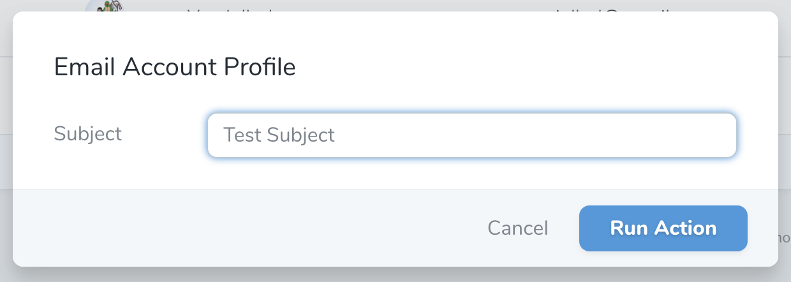

# Defining Actions

[[toc]]

Nova actions allow you to perform custom tasks on one or more Eloquent models. For example, you might write an action that sends an email to a user containing account data they have requested. Or, you might write an action to transfer a group of records to another user.

Once an action has been attached to a resource definition, you may initiate it from the resource's index or detail screens:


## Overview

Nova actions may be generated using the `nova:action` Artisan command. By default, all actions are placed in the `app/Nova/Actions` directory:

```sh
php artisan nova:action EmailAccountProfile
```

To learn how to define Nova actions, let's look at an example. In this example, we'll define an action that sends an email message to a user or group of users:

```php
<?php

namespace App\Nova\Actions;

use App\AccountData;
use Illuminate\Bus\Queueable;
use Laravel\Nova\Actions\Action;
use Illuminate\Support\Collection;
use Laravel\Nova\Fields\ActionFields;
use Illuminate\Queue\SerializesModels;
use Illuminate\Queue\InteractsWithQueue;
use Illuminate\Contracts\Queue\ShouldQueue;

class EmailAccountProfile extends Action
{
    use InteractsWithQueue, Queueable, SerializesModels;

    /**
     * Perform the action on the given models.
     *
     * @param  \Laravel\Nova\Fields\ActionFields  $fields
     * @param  \Illuminate\Support\Collection  $models
     * @return mixed
     */
    public function handle(ActionFields $fields, Collection $models)
    {
        foreach ($models as $model) {
            (new AccountData($model))->send();
        }
    }

    /**
     * Get the fields available on the action.
     *
     * @return array
     */
    public function fields()
    {
        return [];
    }
}
```

The most important method of an action is the `handle` method. The `handle` method receives the values for any fields attached to the action, as well as a collection of selected models. The `handle` method **always** receives a `Collection` of models, even if the action is only being performed against a single model.

Within the `handle` method, you may perform whatever tasks are necessary to complete the action. You are free to update database records, send emails, call other services, etc. The sky is the limit!

## Action Fields

Sometimes you may wish to gather additional information from the user before dispatching an action. For this reason, Nova allows you to attach any of Nova's supported [fields](./../resources/fields.md) directly to an action. When the action is initiated, Nova will prompt the user to provide input for the fields:



To add a field to an action, add the field to the array of fields returned by the action's `fields` method:

```php
use Laravel\Nova\Fields\Text;

/**
 * Get the fields available on the action.
 *
 * @return array
 */
public function fields()
{
    return [
        Text::make('Subject'),
    ];
}
```

Finally, within your action's `handle` method, you may access your fields using dynamic accessors on the provided `ActionFields` instance:

```php
/**
 * Perform the action on the given models.
 *
 * @param  \Laravel\Nova\Fields\ActionFields  $fields
 * @param  \Illuminate\Support\Collection  $models
 * @return mixed
 */
public function handle(ActionFields $fields, Collection $models)
{
    foreach ($models as $model) {
        (new AccountData($model))->send($fields->subject);
    }
}
```

## Queued Actions
