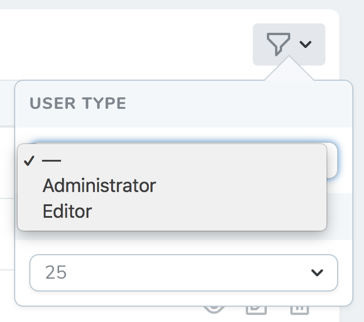

# Defining Filters

[[toc]]

Nova filters allow you to scope your Nova index queries with custom conditions. For example, you may wish to define a filter to quickly view "Admin" users within your application:



To get started, you may use the `nova:filter` Artisan command. By default, Nova will place newly generated filters in the `app/Nova/Filters` directory:

```bash
php artisan nova:filter UserType
```

Each filter generated by Nova contains two methods: `apply` and `options`. The `apply` method is responsible for modifying the query to achieve the desired filter state, while the options method defines the "values" the filter may have. Let's take a look at an example `UserType` filter:

```php
<?php

namespace App\Nova\Filters;

use Illuminate\Http\Request;
use Laravel\Nova\Filters\Filter;

class UserType extends Filter
{
    /**
     * Apply the filter to the given query.
     *
     * @param  \Illuminate\Http\Request  $request
     * @param  \Illuminate\Database\Eloquent\Builder  $query
     * @param  mixed  $value
     * @return \Illuminate\Database\Eloquent\Builder
     */
    public function apply(Request $request, $query, $value)
    {
        return $query->where('type', $value);
    }

    /**
     * Get the filter's available options.
     *
     * @param  \Illuminate\Http\Request  $request
     * @return array
     */
    public function options(Request $request)
    {
        return [
            'Administrator' => 'admin',
            'Editor' => 'editor',
        ];
    }
}
```

The `options` method should return an array of keys and values. The array's keys will be used as the "human-friendly" text that will be displayed in the Nova UI. The array's values will be passed into the `apply` method as the `$value` argument. This filter defines two possible values: `admin` and `editor`.

As you can see in the example above, you may leverage the incoming `$value` to modify your query. The `apply` method should return the modified query instance.
