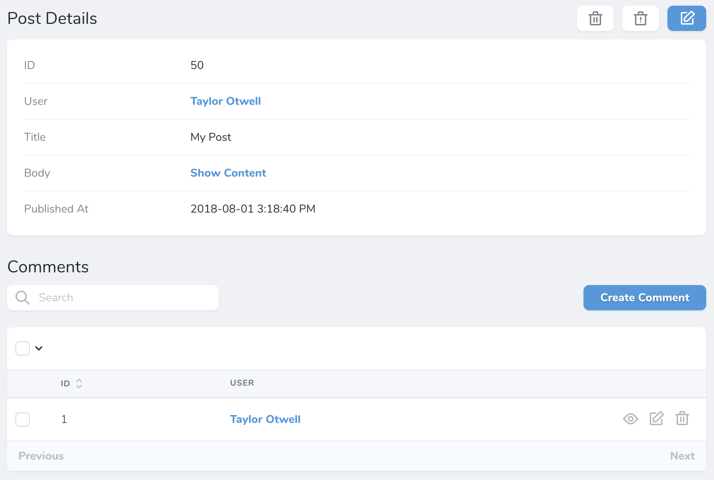

# Relationships

[[toc]]

In addition to the variety of fields we've already discussed, Nova has full support for all of Laravel's relationships. Once you add relationship fields to your Nova resources, you'll start to experience the full power of the Nova dashboard, as the resource detail screen will allow you to quickly view and search a resource's related models:



## HasOne

The `HasOne` field corresponds to a `hasOne` Eloquent relationship. For example, let's assume a `User` model `hasOne` `Address` model. We may add the relationship to our `User` Nova resource like so:

```php
use Laravel\Nova\Fields\HasOne;

HasOne::make('Address')
```

Like other types of fields, relationship fields will automatically "snake case" the displayable name of the field to determine the underlying relationship method / attribute. However, you may explicitly specify the name of the relationship method by passing it as the second argument to the field's `make` method:

```php
HasOne::make('Dirección', 'address')
```

## HasMany

The `HasMany` field corresponds to a `hasMany` Eloquent relationship. For example, let's assume a `User` model `hasMany` `Post` models. We may add the relationship to our `User` Nova resource like so:

```php
use Laravel\Nova\Fields\HasMany;

HasMany::make('Posts')
```

## BelongsTo

The `BelongsTo` field corresponds to a `belongsTo` Eloquent relationship. For example, let's assume a `Post` model `belongsTo` a `User` model. We may add the relationship to our `Post` Nova resource like so:

```php
use Laravel\Nova\Fields\BelongsTo;

BelongsTo::make('User')
```

#### Title Attributes

When a `BelongsTo` field is shown on a resource creation / update screen, a drop-down selection menu or search menu will display the "title" of the resource. For example, a `User` resource may use the `name` attribute as its title. Then, when the resource is shown in a `BelongsTo` selection menu, that attribute will be displayed:


To customize the "title" attribute of a resource, you may define a `title` property on the resource class:

```php
public static $title = 'name';
```

Alternatively, you may override the resource's `title` method:

```php
/**
 * Get the value that should be displayed to represent the resource.
 *
 * @return string
 */
public function title()
{
    return $this->name;
}
```

## BelongsToMany

## MorphMany

## MorphToMany

## Searchable Relations
