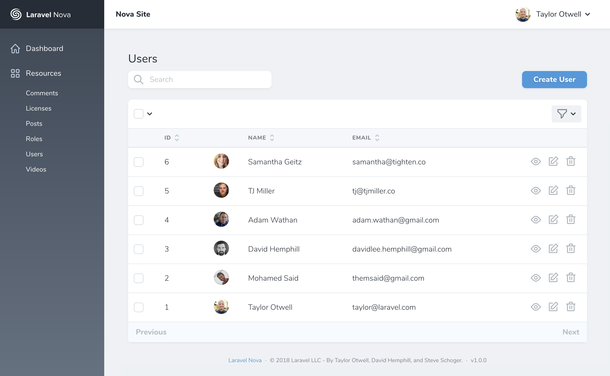

# The Basics

[[toc]]

Laravel Nova is a beautiful administration dashboard for Laravel applications. Of course, the primary feature of Nova is the ability to administer your underlying database records using Eloquent. Nova accomplishes this by allowing you to define a Nova "resource" that corresponds to each Eloquent model in your application.

## Defining Resources

By default, Nova resources are stored in the `app/Nova` directory of your application. You may generate a new resource using the `nova:resource` Artisan command:

```bash
php artisan nova:resource Post
```

The most basic and fundamental property of a resource is its `model` property. This property tells Nova which Eloquent model the resource corresponds to:

```php
/**
 * The model the resource corresponds to.
 *
 * @var string
 */
public static $model = 'App\Post';
```

Freshly created Nova resources only contain an `ID` field definition. Don't worry, we'll add more fields to our resource soon.

## Registering Resources

:::tip Automatic Registration

By default, all resources within the `app/Nova` directory will automatically be registered with Nova. You are not required to manually register them.
:::

Before resources are available within your Nova dashboard, they must first be registered with Nova. Resources are typically registered in your `app/Providers/NovaServiceProvider.php` file. This file contains various configuration and bootstrapping code related to your Nova installation.

**As mentioned above, you are not required to manually register your resources; however, if you choose to do so, you may do so by overriding the `resources` method of your `NovaServiceProvider`**.

There are two approaches to manually registering resources. You may use the `resourcesIn` method to instruct Nova to register all Nova resources within a given directory. Alternatively, you may use the `resources` method to manually register individual resources:

```php
use App\Nova\User;
use App\Nova\Post;

/**
 * Register the application's Nova resources.
 *
 * @return void
 */
protected function resources()
{
    Nova::resourcesIn(app_path('Nova'));

    Nova::resources([
        User::class,
        Post::class,
    ]);
}
```

Once your resources are registered with Nova, they will be available in the Nova sidebar:



If you do not want a resource to appear in the sidebar, you may override the `displayInNavigation` property of your resource class:

```php
/**
 * Indicates if the resource should be displayed in the sidebar.
 *
 * @var bool
 */
public static $displayInNavigation = false;
```

## Grouping Resources

If you would like to separate resources into different sidebar groups, you may override the `group` property of your resource class:

```php
/**
 * The logical group associated with the resource.
 *
 * @var string
 */
public static $group = 'Admin';
```

## Eager Loading

If you routinely need to access a resource's relationships within your fields, [resource title](./../search/global-search.md#title-subtitle-attributes), or [resource subtitle](./../search/global-search.md#title-subtitle-attributes), it may be a good idea to add the relationship to the `with` property of your resource. This property instructs Nova to always eager load the listed relationships when retrieving the resource.

For example, if you access a `Post` resource's `user` relationship within the `Post` resource's `subtitle` method, you should add the `user` relationship to the `Post` resource's `with` property:

```php
/**
 * The relationships that should be eager loaded on index queries.
 *
 * @var array
 */
public static $with = ['user'];
```

## Resource Events

All Nova operations use the typical `save`, `delete`, `forceDelete`, `restore` Eloquent methods you are familiar with. Therefore, it is easy to listen for model events triggered by Nova and react to them. The easiest approach is to simply attach a [model observer](https://laravel.com/docs/eloquent#observers) to a model:

```php
namespace App\Providers;

use App\User;
use App\Observers\UserObserver;
use Illuminate\Support\ServiceProvider;

class AppServiceProvider extends ServiceProvider
{
    /**
     * Bootstrap any application services.
     *
     * @return void
     */
    public function boot()
    {
        User::observe(UserObserver::class);
    }

    /**
     * Register the service provider.
     *
     * @return void
     */
    public function register()
    {
        //
    }
}
```

If you would like to attach any observer **only during** Nova related HTTP requests, you may register observers within `Nova::serving` event listener in your application's `NovaServiceProvider`. This listener will only be executed during Nova requests:

```php
use App\User;
use Laravel\Nova\Nova;
use App\Observers\UserObserver;

/**
 * Bootstrap any application services.
 *
 * @return void
 */
public function boot()
{
    parent::boot();

    Nova::serving(function () {
        User::observe(UserObserver::class);
    });
}
```

## Preventing Conflicts

If the model has been updated since the retrieval, Nova will automatically respond with a `409 Conflict` status code and display an error message to prevent unintentional model changes. This may occur if another user updates the model after you have opened the "Edit" screen on the resource.

## Keyboard Shortcuts

You may press the `C` key on a resource index to navigate to the "Create Resource" screen. On the resource detail screen, the `E` key may be used to navigate to the "Update Resource" screen.

## Pagination

Nova has the ability to show pagination links for your Resource listings in two different styles: a beautiful "simple" style which uses "Previous" and "Next" links and a more-traditional page-based "links" format:


By default, Nova Resources are displayed using the "simple" style. However, you may customize this to use the "links" style. You can enable this by setting the `pagination` option in your `config/nova.php` configuration file:

```php
'pagination' => 'links',
```

## Customizing Pagination

If you'd like to customize the amounts shown on each resource's "per page" filter menu, you can do so by customizing its `perPageOptions` property:

```php
/**
 * The pagination per-page options configured for this resource.
 *
 * @return array
 */
public static $perPageOptions = [50, 100, 150];
```
